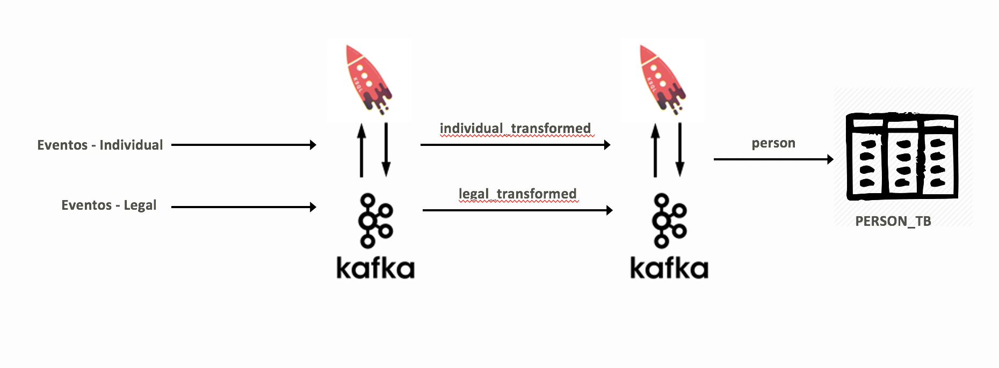
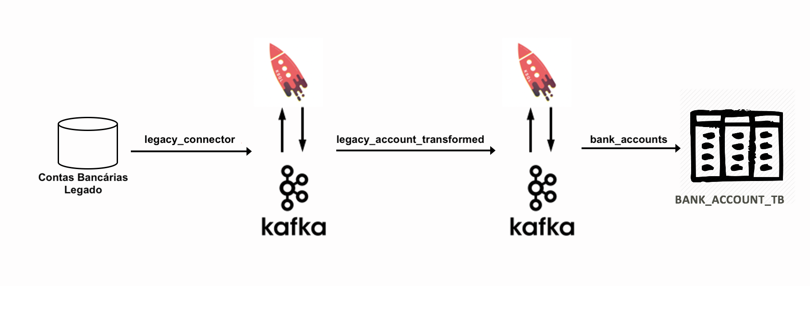
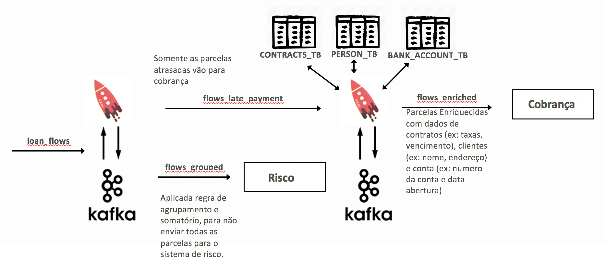
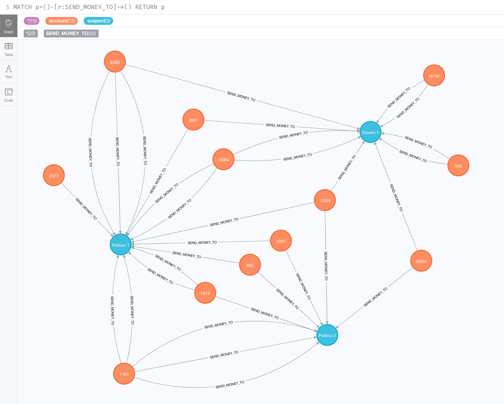

POC Kafka and KSQL - Hands on Guide
===================================


# Objetivo POC

Requisitos:

-   Recebimento de Eventos:

    -   Necessidade de receber eventos no formato REST (http através do kafka rest
        proxy)

    -   Necessidade de receber eventos de Banco de Dados Legado (Através do Kafka Connector)

-   Armazenamento de Eventos: Event Store (Topicos e Tables do ksqlDB).

-   Transformação: agregação, joins, filtros, agrupamento, etc
    (Processamento de Streams do ksqlDB)

-   Criação de view materializadas: armazenamento do estado atual de uma
    entidade (Tables do ksqlDB)

-   Envio de informações para diversos destinos (Kafka connector sink).

# Ambiente

Foi utilizada a versão (5.5.1) da stack da CONFLUENT PLATFORM.

1.  Iniciando o ambiente

    ``` {.highlight}
    git clone https://github.com/giovanibrioni/poc-kafka-ksql.git
    cd poc-kafka-ksql
    docker-compose up -d
    ```

2.  Verificar se o ksqldb está no ar com o KSQL CLI:

    ``` {.highlight}
    docker exec -it ksqldb-cli bash -c 'echo -e "\n\n⏳ Waiting for KSQL to be available before launching CLI\n"; while [ $(curl -s -o /dev/null -w %{http_code} http://ksqldb-server:8088/) -eq 000 ] ; do echo -e $(date) "KSQL Server HTTP state: " $(curl -s -o /dev/null -w %{http_code} http://ksqldb-server:8088/) " (waiting for 200)" ; sleep 5 ; done; ksql http://ksqldb-server:8088'
    ```

3.  Verificar o Confluent Control Center: <http://localhost:9021>

# Demo 1: Simular Recebimento de Eventos via http

Nesta simulação teremos eventos de criação e atualização de dados de pessoas físicas(legal.created, legal.updated) e jurídicas(individual.created e
individual.updated)

Vamos criar streams de transformação de dados e gravar o
estado atual da pessoa(tanto física, quanto jurídica) na tabela PERSON\_TB:



1.  Criar o Topico que receberá os eventos de individual

    ``` {.highlight}
    sh ./01-person/01-event-person-individual/01-create-topic.sh
    ```

2.  Criar o Stream baseado no tópico que receberá os eventos

    ``` {.highlight}
    CREATE STREAM EV_PERSON_INDIVIDUAL (class VARCHAR, person_id VARCHAR, 
            individual STRUCT<name VARCHAR,
                            cpf VARCHAR,
                            email VARCHAR,
                            address STRUCT<address_id BIGINT,
                                            type VARCHAR,
                                            zip_code VARCHAR,
                                            street VARCHAR,
                                            number VARCHAR,
                                            complement VARCHAR,
                                            city VARCHAR,
                                            state VARCHAR,
                                            country VARCHAR>,
                            phone STRUCT<phone_id BIGINT,
                                            type VARCHAR,
                                            area_code VARCHAR,
                                            country_code VARCHAR,
                                            number VARCHAR>>) 
        WITH (kafka_topic='ev_person_individual', value_format='JSON');
    ```

3.  Criar o Stream que transforma os eventos recebidos via REST no
    formato que será gravado na tabela

    ``` {.highlight}
    CREATE STREAM EV_PERSON_INDIVIDUAL_TRANSFORMED 
        WITH (kafka_topic='person', value_format='AVRO') 
        AS SELECT person_id, class  AS type, 
                individual->cpf     AS document_number, 
                individual->name    AS name, 
                individual->email   AS email, 
                individual->address AS address, 
                individual->phone   AS phone, 
                ROWTIME             AS last_update_date 
            FROM EV_PERSON_INDIVIDUAL 
            PARTITION BY individual->cpf EMIT CHANGES;
    ```

4.  Criar a Tabela que grava somente o estado atual da pessoa

    ``` {.highlight}
    CREATE TABLE PERSON_TB (document_number VARCHAR, person_id VARCHAR, type VARCHAR, last_update_date BIGINT,
            name VARCHAR,
            email VARCHAR,
            address STRUCT<address_id BIGINT,
                            type VARCHAR,
                            zip_code VARCHAR,
                            street VARCHAR,
                            number VARCHAR,
                            complement VARCHAR,
                            city VARCHAR,
                            state VARCHAR,
                            country VARCHAR>,
            phone STRUCT<phone_id BIGINT,
                        type VARCHAR,
                        area_code VARCHAR,
                        country_code VARCHAR,
                        number VARCHAR>) 
        WITH (kafka_topic='person', value_format='AVRO', KEY='document_number');
    ```

5.  Deixar uma janela aberta mostrando o stream já transformado

    ``` {.highlight}
    SELECT  TIMESTAMPTOSTRING( LAST_UPDATE_DATE , 'yyyy-MM-dd HH:mm:ss') LAST_UPDATE_DATE,
            document_number,
            person_id,
            name,
            email,
            type,
            address,
            phone
    FROM EV_PERSON_INDIVIDUAL_TRANSFORMED EMIT CHANGES;
    ```

6.  Inserir os eventos no tópico via http e verificar os dados chegando
    no stream

    ``` {.highlight}
    sh ./01-person/01-event-person-individual/04-individual-created.sh
    ```

7.  Inserir os eventos simulando uma atualização dos dados

    ``` {.highlight}
    sh ./01-person/01-event-person-individual/05-individual-updated.sh
    ```

8.  Verificar que na tabela só aparece 1 registro por pessoa com a
    informação mais atual

    ``` {.highlight}
    SELECT TIMESTAMPTOSTRING( LAST_UPDATE_DATE , 'yyyy-MM-dd HH:mm:ss') LAST_UPDATE_DATE,
            document_number,
            person_id,
            name,
            email,
            type,
            address,
            phone
    FROM PERSON_TB EMIT CHANGES;
    ```

9.  Criar o Topico que receberá os eventos de legal

    ``` {.highlight}
    sh ./01-person/02-event-person-legal/01-create-topic.sh
    ```

10. Criar os STREAMS de legal

    ``` {.highlight}
    docker exec ksqldb-cli bash -c "cat /data/01-person/02-event-person-legal/02-legal-created-stream-table.sql <(echo 'EXIT')| ksql http://ksqldb-server:8088"
    ```

11.  Criar os eventos de legal.created e legal.updated

    ``` {.highlight}
    sh ./01-person/02-event-person-legal/03-legal-created.sh
    sh ./01-person/02-event-person-legal/04-legal-updated.sh
    ```

12. Verificar que os eventos de legal foram transformados para a mesma
    estrutuda na tabela e também só mostram o estado mais atual

    ``` {.highlight}
    SELECT TIMESTAMPTOSTRING( LAST_UPDATE_DATE , 'yyyy-MM-dd HH:mm:ss') LAST_UPDATE_DATE,
            document_number,
            person_id,
            name,
            email,
            type,
            address,
            phone
    FROM PERSON_TB EMIT CHANGES;
    ```

 # Demo 2: Usar Kafka Connector para receber contas bancárias do Legado 

Criar um Conector para trazer as contas bancárias para o kafka,
criar streams de transformação de dados e gravar o estado atual da conta
na tabela BANK\_ACCOUNTS\_TB:



1.  Criar o Topico que receberá os dados das contas

    ``` {.highlight}
    sh ./02-legacy-account/01-create-topic.sh
    ```

2.  Criar o stream para transformar o evento na estrutura da tabela e
    criar a tabela BANK\_ACCOUNTS\_TB

    ``` {.highlight}
    docker exec ksqldb-cli bash -c "cat /data/02-legacy-account/02-account-stream-table.sql <(echo 'EXIT')| ksql http://ksqldb-server:8088"
    ```

3.  Criar o Conector que irá receber os dados do Legado. 

    ``` {.highlight}
    sh ./02-legacy-account/03-connect-legacy-account.sh
    ```

4.  Se não tiver os dados de conexão do banco Legacy, pode usar o gerador de
    dados abaixo para fazer a simulação.

    ``` {.highlight}
    sh ./02-legacy-account/03-generate-accounts.sh
    ```

5.  Verificar a tabela com as contas criadas

    ``` {.highlight}
    SELECT  document_number,
            account_number,
            account_status
    FROM BANK_ACCOUNTS_TB EMIT CHANGES;
    ```

6.  Fazer um join entre as tabelas BANK\_ACCOUNT\_TB e PERSON\_TB

    ``` {.highlight}
    SELECT  P.DOCUMENT_NUMBER,
            NAME,
            ACCOUNT_NUMBER,
            ACCOUNT_STATUS
    FROM  PERSON_TB P
    LEFT JOIN BANK_ACCOUNTS_TB BA
            ON BA.DOCUMENT_NUMBER = P.DOCUMENT_NUMBER
    WHERE P.DOCUMENT_NUMBER = '14897275903'
    EMIT CHANGES;
    ```

# Demo 3: Emprestimo: Executar filtros, agrupamento e enriquecimento de dados para atender cenários distindos em Cobrança e Risco 

-   Cenário Cobrança: Cobrança não precisa receber todas as parcelas de
    emprestimo, só é necessário receber as parcelas de empréstimo
    atrasadas. As parcelas atrasadas devem ser enriquecidas com dados de
    contratos, dados da conta e do devedor.

-   Cenário Risco: Risco não precisa receber todos os dados das
    parcelas, nem precisa agregar com outras informações, somente
    precisa do valor desta parcelas, respeitando uma regra de
    agrupamento.



1.  Criar os Topicos que receberão os dados de contrato de empréstimo e
    os status das parcelas de emprestimo.

    ``` {.highlight}
    sh ./03-loan/01-create-topics.sh
    ```

2.  Criar o stream de contratos e a tabela CONTRACTS\_TB com a
    informação mais atual do contrato, necessário para fazer o
    enriquecimento de cobrança.

    ``` {.highlight}
    docker exec ksqldb-cli bash -c "cat /data/03-loan/02-contracts-stream-table.sql <(echo 'EXIT')| ksql http://ksqldb-server:8088"
    ```

3.  Simular eventos de criação de contratos.

    ``` {.highlight}
    sh ./03-loan/04-generate-contracts.sh
    ```

4.  Verificar os contratos criados

    ``` {.highlight}
    SELECT  document_number,
            contract_id,
            status,
            TIMESTAMPTOSTRING( start_date , 'yyyy-MM-dd HH:mm:ss') start_date,
            TIMESTAMPTOSTRING( end_date , 'yyyy-MM-dd HH:mm:ss') end_date,
            interest_rate, fine_for_delay, total_installments
    FROM LOAN_CONTRACTS_TB EMIT CHANGES;
    ```

5.  Criar o stream de parcelas e a tabela LOAN\_FLOWS\_TB com a
    informação mais atual da parcela.

    ``` {.highlight}
    docker exec ksqldb-cli bash -c "cat /data/03-loan/05-flows-stream-table.sql <(echo 'EXIT')| ksql http://ksqldb-server:8088"
    ```

6.  Criar o stream de parcelas atrasadas e parcelas enriquecidas por
    contrato, conta e pessoa.

    ``` {.highlight}
    docker exec ksqldb-cli bash -c "cat /data/03-loan/06-flows-collection.sql <(echo 'EXIT')| ksql http://ksqldb-server:8088"
    ```

7.  Simular eventos de alteração em PARCELAS.

    ``` {.highlight}
    sh ./03-loan/07-generate-flows.sh
    ```

8. Abrir uma janela para verificar o stream de parcelas

    ``` {.highlight}
    SELECT contract_id,
            installment_number,
            status,
            present_value
    FROM LOAN_FLOWS
    EMIT CHANGES;
    ```

9. Abrir outra janela onde só irão aparecer as parcelas atrasadas

    ``` {.highlight}
    SELECT contract_id,
            installment_number,
            status,
            present_value
    FROM LOAN_FLOWS_LATE_PAYMENT
    EMIT CHANGES;
    ```

10. Esta consulta mostra as parcelas atrasadas, enriquecida com dados do
    devedor, do contrato e da conta

    ``` {.highlight}
    SELECT  contract_id,
            installment_number,
            status,
            present_value,
            name,
            account_number,
            fine_for_delay
    FROM LOAN_FLOWS_LATE_PAYMENT_ENRICHED_COMPLETE
    EMIT CHANGES;
    ```

11. O Sistema de Risco, aplicou uma regra de agrupamento por vencimento
    e status da parcela, para calcular o valor de risco somente com base
    no somatório dos valores das parcelas

    ``` {.highlight}
    SELECT  TIMESTAMPTOSTRING( due_date , 'yyyy-MM-dd') as due_date,
            status,
            COUNT(*) AS installments_by_status,
            SUM(present_value) AS present_value
    FROM LOAN_FLOWS_TB
    GROUP BY due_date, status
    EMIT CHANGES;
    ```

# Demo 4: PLD - Identificar TEDs suspeitas, feitas para usuários em Black List. 

Cenário: Todas as TEDs feitas para usuários na Black List são filtradas
em um stream, e um conector do kafka envia estas TEDs suspeitas para o
Neo4j, para facilitar a identificação da rede de lavagem de dinheiro.

1.  Criar os Topicos que receberão os dados das pessoas na Black List e
    as transações efetuadas.

    ``` {.highlight}
    sh ./04-PLD/01-create-topics.sh
    ```

2.  Inserir os suspeitos de lavagem de dinheiro na Black List

    ``` {.highlight}
    docker exec ksqldb-cli bash -c "cat /data/04-PLD/02-create-black-list.sql <(echo 'EXIT')| ksql http://ksqldb-server:8088"
    ```

3.  Criar um stream que filtra somente as TEDs e outro que filtra as
    TEDs efetuadas para as pessoas na Black List

    ``` {.highlight}
    docker exec ksqldb-cli bash -c "cat /data/04-PLD/03-streams-PLD.sql <(echo 'EXIT')| ksql http://ksqldb-server:8088"
    ```

4.  Criar o gerador de transações.

    ``` {.highlight}
    sh ./04-PLD/05-generate-transactions.sh
    ```

5.  Abrir uma janela para ver todas as transações

    ``` {.highlight}
    SELECT TXN_ID ,
             ORIGIN_ACCOUNT_NUMBER ,
             RECIPIENT_DOCUMENT_NUMBER ,
             TYPE ,
             AMOUNT
    FROM TXNS
    EMIT CHANGES;
    ```

6.  Em outra janela verificar somente as TEDs

    ``` {.highlight}
    SELECT TXN_ID ,
             ORIGIN_ACCOUNT_NUMBER ,
             RECIPIENT_DOCUMENT_NUMBER ,
             TYPE ,
             AMOUNT
    FROM TXNS_TED
    EMIT CHANGES;
    ```

7.  Esta query mostra somente as TEDs suspeitas, feitas para pessoas na
    Black List

    ``` {.highlight}
    SELECT TXN_ID,
             ORIGIN_ACCOUNT_NUMBER,
             RECIPIENT_DOCUMENT_NUMBER,
             AMOUNT,
             SUSPECT_NAME
    FROM SUSPICIOUS_TXNS
    EMIT CHANGES;
    ```

8.  Criar o Conector que envia as TEDs suspeitas para o Neo4j

    ``` {.highlight}
    curl -s \
         -X "POST" "http://localhost:8083/connectors/" \
         -H "Content-Type: application/json" \
         -d '{
              "name": "sink_neo4j_ted_send",
              "config": {
                "connector.class": "streams.kafka.connect.sink.Neo4jSinkConnector",
                "errors.tolerance": "all",
                "errors.log.enable": true,
                "errors.log.include.messages": true,
                "neo4j.server.uri": "bolt://neo4j:7687",
                "neo4j.authentication.basic.username": "neo4j",
                "neo4j.authentication.basic.password": "connect",
                "topics": "SUSPICIOUS_TXNS",
                "neo4j.topic.cypher.SUSPICIOUS_TXNS": "MERGE (ac:account{account_id: event.ORIGIN_ACCOUNT_NUMBER}) merge (suspect:suspect{name: event.SUSPECT_NAME}) merge (ac)-[:SEND_MONEY_TO{amount:event.AMOUNT,txn_id:event.TXN_ID}]->(suspect)"
              }
            } '
    ```

9.  Verificar as TEDs suspeitas no Neo4j

    -   Launch [Neo4j Browser](http://localhost:7474/browser/) (login:
        `neo4j / connect`) and run query:

        ``` {.highlight}
        MATCH p=()-[r:SEND_MONEY_TO]->() RETURN p
        ```

<!--  -->
